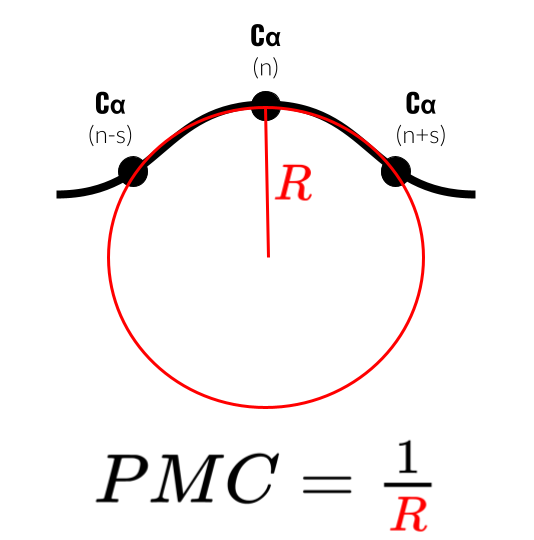

A more in-depth discussion is available in the Biorxiv preprint at <https://www.biorxiv.org/content/10.1101/2025.04.04.647214v1>

## State of the field

New difficulties regarding the analysis of molecular dynamics (MD) simulations have emerged as MD becomes more and more involved in deciphering the behavior of highly flexible polymers such as Intrinsically Disordered Regions and Proteins (IDRs and IDPs). Characterization of their conformational ensemble (CoE) generally relies on global observables such as the radius of gyration. However, this global characterization cannot provide information on the local behavior of the backbone which participates in the IDP or IDR compactness and dynamics. Complex behaviors resulting from transient interactions and strong exposure to the solvent drastically reduce the insight provided by commonly used metrics such as the Root-Mean-Squared Fluctuations (RMSF). Past attempts to probe or to compare CoEs have proven successful in extending the bioinformatic toolbox available for IDPs and IDRs, but often at the cost of computational speed and interpretability of the metrics [@david_principal_2014; @zhou_t-distributed_2018; @gonzalez-delgado_wasco_2022]. A successful attempt for a simpler flexibility metrics at the residue level was already made using Protein Blocks (PBs) by Barnoud et al with their Equivalent Number of PBs (Neq) [@barnoud_pbxplore_2017]. By statistically quantifying how many PBs are accessed by an amino acid along a simulation, the Neq can provide a value between 1 and 16 corresponding to low to high flexibility respectively.

## Statement of need

Although the PBs and Neq are adequate to describe the proteic backbone and its flexibility, they suffer from a few shortcomings. First, the PBs are specific to proteins and were designed from a statistical clustering of the Protein Data Bank [@berman_PDB_2000], an ever-growing and ever-evolving repository of protein structures with a known biased towards folded proteins. Second, the main calculation tool PBxplore is not parallelized. Finally, PBs are specific to the proteic backbone and cannot be generalized to other polymers.
We previously introduced an alternative metric, the Local Flexibilities (LFs), to successfully characterize the loss in flexibility induced by nP-collabs in multiphosphorylated peptides [@marien_np-collabs_2024]. They are based on a calculation of the Menger curvatures of the backbone at the residue level called in this context the Proteic Menger Curvatures (PMCs). Menger curvatures can also be used to obtain Local Curvatures (LCs) as the average curvature of a residue. PMCs, LCs and LFs were employed to reveal the mechanism of wrapping of tubulin C-terminal tails around an IDP [@marien_impact_2025]. Recently, LFs were even shown to correlate with the T2 relaxation times of the Tau protein backbone [@marien_across_2025], an observable notorious to reflect flexibility in proteins, emphasizing the fundamental interest of curvature-based metrics for polymer studies. To increase performances and ease-of-use of the PMCs, we propose a new implementation in the form of a MDAKit named Menger_Curvature, based on the widely-used MDAnalysis ecosystem. We first introduce formally the definition of a Menger curvature, before describing the package implementation.

## Menger curvatures, Local FLexibilies (LFs) and Local Curvatures (LCs)

A visual schematics of the definition of the Menger curvature is available in Figure \autoref{fig:PMC_def}.
Consider a triangle. The circumcircle of this triangle (i.e. the circle passing through each of its summits) has a radius $R$, and its inverse is defined as the Menger curvature, named after mathematician Karl Menger [@menger1954geometrie]. The curvature of a point in a polymer backbone can therefore be defined by selecting two other points of the backbone and calculating the resulting Menger curvature. We here focus on the context of proteins to demonstrate the use of such a metric.
We define the PMC($n$) by applying the Menger curvature to the triangle formed by the $C\_\alpha$ of residue $n$ and those of residues $n-s$ and $n+s$ where $s$ is defined as the spacing. LC($n$) is the average value of PMC($n$) over all conformations, and LF($n$) is the standard deviation over all conformations. The $n$ subscript can be dropped for clarity and PMCs, LCs and LFs designate the contracted plural forms of the names. A Python module based on MDAnalysis [@michaud-agrawal_mdanalysis_2011] was previously developed and can be accessed at : <https://github.com/Jules-Marien/Articles/tree/main/_2024_Marien_nPcollabs/Demo_and_scripts_Proteic_Menger_Curvature>. The aim of this implementation is to refine this code, parallelize it and implement it as a fully developed python package as an MDAKit [@alibay_mdakits_2023].

Further considerations on the choice of spacing $s$ and the biochemical relevance of the PMCs, LFs and LCs can be accessed in the developed version of this paper (link above). We still provide a structural interpretation of the values of the PMCs in Figure \autoref{fig:PMC_range}. An example notebook is provided at <https://github.com/EtienneReboul/menger_curvature/blob/main/notebooks/jm01-tutorial.ipynb>

## Software Design

The Menger\_Curvature package is a MDAkit built on the MDAnalysisBase class. We choosed MDAnalysis as a base library for our software because it is one of the most popular open source softwares for MD processing and analysis. It also has a long-term support provided by the core developper team. We choosed to follow the standard MDAkit structure because it mimicks the same API that is common to most analysis classes of MDAnalysis. Thus, it provides a smoother experience with an easy learning curve for regular MDAnalysis users. MDAnalysis also supports most file formats and has lazy evaluation for MD simulation via threadsafe and easily serialisable classes, allowing the MDAnalysisBase class to support two parallelisation backends : python built-in multiprocessing and Dask. Having efficient parallelisation options is critical for our package as calculating PMCs on a whole trajectory is both a compute intensive process and embarrassingly parallelizable problem. Calculation of PMCs are furthermore accelerated with Numba just-in-time (JIT) compiler [@lam_numba_2015]. Combining JIT compilation with efficient parallelisation is key to achieve significant speedup compared to baseline as shown in the reseach impact statement section.

## Research impact statement

Menger_curvature has first been widely disseminated within the lab, with colleagues applying the PMC metrics to a variety of questions and molecule types. The Menger_Curvature package has already been identified as a key progress in the characterization of protein flexibility, as illustrated by its mention in the recent review on PBs by Offmann and de Brevern [offmann_review_2025]. The PMCs, LCs and LFs were discussed enthusiastically with the molecular dynamics community at the Group of Graphism and Molecular Modelling Congress in 2025, and multiple uses of Menger_Curvature are expected to follow in the near future. On a wider perspective, the recent advancement by Marien et al showing that the LFs are closely related to the T2 relaxation times in the Tau protein should create significant interest for the metric as an interpretable characterization of NMR relaxation data [marien_across_2025].

We further show a significant speed up compared to  the state of the art in the field as shown in Table 1.

|                | PMCs, LCs and LFs (serial) | PMCs, LCs and LFs (parallel) | PBs and Neq    | RMSF         |
|----------------|----------------------------|------------------------------|----------------|--------------|
| Tubulin        | 0.23 ± 0.00                | 0.19 ± 0.01                  | 10.54 ± 0.17   | 1.21 ± 0.02  |
| Tau protein    | 4.54 ± 0.50                | 2.84 ± 0.05                  | 218.48 ± 1.17  | 22.96 ± 0.44 |

*Table 1: Table comparing the computation time in seconds of the PMCs, Neq, and RMSF on a short tubulin trajectory (1000 frames, 450 Cαs) and a long Tau protein trajectory (20000 frames, 441 Cαs). The alignment time of all conformations on the reference was included in the runtime of RMSF as it is necessary for the calculation.*

Menger\_Curvature is available in the Python Package Index and on Github : <https://github.com/EtienneReboul/menger_curvature>

## Figures

{ width=60% }

![Range of PMC values and their associated structural elements. Backbone representations are extracted from the single chain tubulin simulation. Backbone is represented in licorice, $C_\alpha$s involved in the PMC calculations are in black Van de Waals. Ranges for $\beta$-sheets and $\alpha$-helices are based on the ranges of PMC values above 5\% in Figure SI-1. These ranges are not meant to be statistically accurate but to provide the reader with a practical estimate of the values that can be expected. \label{fig:PMC_range}](../figures/Figure_2.svg){ width=100% }

{ width=100% }

## Acknowledgements

Authors thank Pierre Poulain for fruitful discussions on the Python implementation and the notion of flexibility, Lucas Rouaud for his advice in code development and Laetitia Kantin for beta-testing of the MDAKit installation.

## AI usage disclosure

Microsoft Copilot was used to troubeshoot bugs and for formating docstrings. The mitigation strategy we employ to limit the impact of AI hallucination is to have a high unit test coverage of Menger curvature module (97%).

## References
